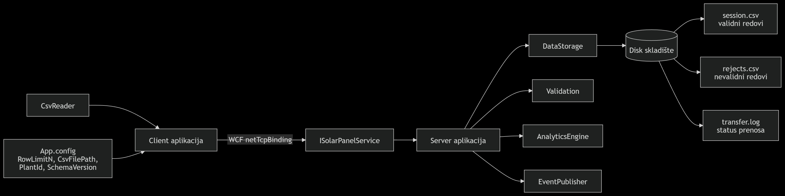
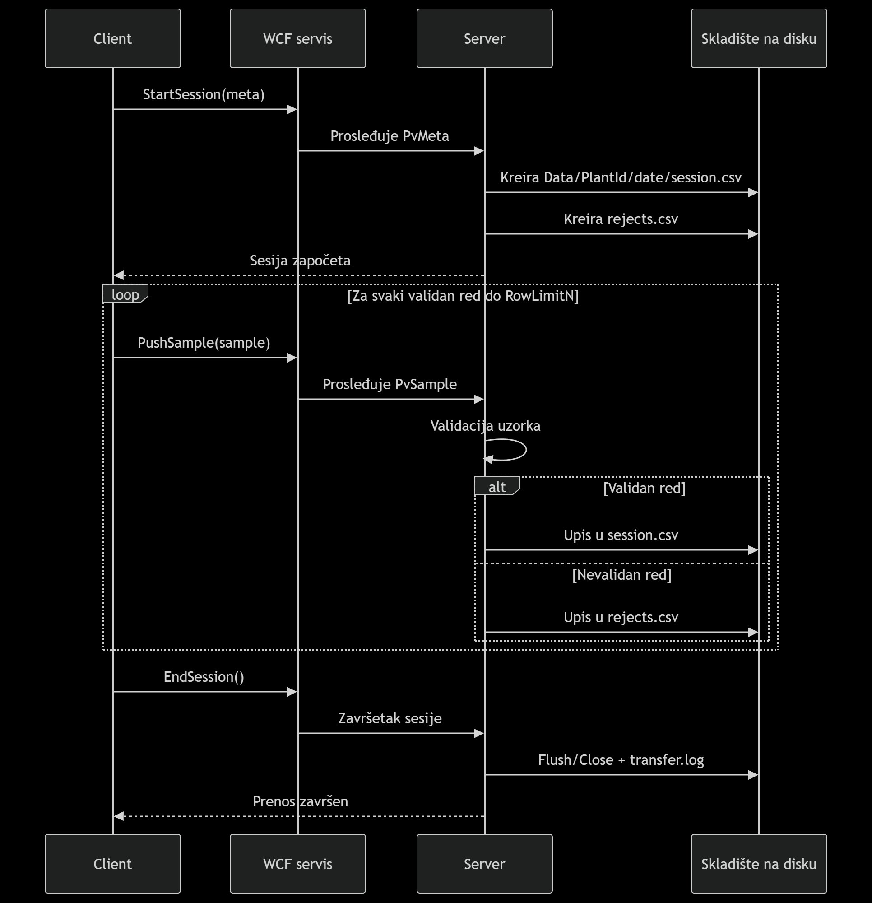

# Solar Panel — WCF Data Transfer System

Klijent–server sistem za prikupljanje, razmenu i skladištenje podataka o radu solarnog panela korišćenjem WCF servisa i događajnog modela (.NET Framework 4.7.2).

---

## Postavljanje CSV fajla (baza podataka)

CSV fajl se preuzima sa GitHub repozitorijuma:

**https://github.com/Invincible-pedkeee/Databasevp**

1. Otvori link
2. Klikni **Code → Download ZIP** ili kloniraj repozitorijum
3. Izvuci fajl `Floating_PV_Altamonte_FL_Data.csv`
4. Postavi ga na sljedeću putanju:

```
VP PROJECT\Client\bin\Debug\Data\Floating_PV_Altamonte_FL_Data.csv
```

> Ako folder `Data` ne postoji, kreiraj ga ručno.

---

## Pokretanje projekta

### Korak 1 — Pokreni Server

1. Desni klik na projekt `Server` → **Set as Startup Project**
2. Pokreni (**F5** ili **Ctrl+F5**)
3. Čekaj poruku: `[SERVER] Service started.`

### Korak 2 — Pokreni Client

1. Desni klik na projekt `Client` → **Set as Startup Project**
2. Pokreni (**F5** ili **Ctrl+F5**)
3. Klijent čita CSV red po red i odmah šalje svaki uzorak serveru

### Pokretanje testova

```
Test → Run All Tests  (Ctrl+R, A)
```

---

## Konfiguracija

### Client — `Client/App.config`

| Ključ | Opis | Default |
|---|---|---|
| `RowLimitN` | Koliko redova klijent šalje | `100` |
| `CsvFilePath` | Putanja do CSV fajla | `Data\Floating_PV_Altamonte_FL_Data.csv` |
| `PlantId` | Identifikator postrojenja | `AltamonteFL` |
| `SchemaVersion` | Verzija sheme | `1.0` |
| `RejectedLogPath` | Putanja za odbačene redove na klijentu | `rejected_client.csv` |

### Server — `Server/App.config`

| Ključ | Opis | Default |
|---|---|---|
| `OverTempThreshold` | Prag temperature za alarm (°C) | `60.0` |
| `VoltageImbalancePct` | Dozvoljeni % disbalansa napona | `0.05` (5%) |
| `PowerFlatlineWindow` | Broj uzastopnih redova za flatline alarm | `10` |
| `PowerSpikeThreshold` | Prag naglog porasta snage (W) | `500.0` |
| `FlatlineEpsilon` | Minimalna promjena da se ne smatra flatline | `0.1` |

---

## Izlazni fajlovi

Svi fajlovi se nalaze u:
```
Server/bin/Debug/Data/<PlantId>/<YYYY-MM-DD>/
```

| Fajl | Opis |
|---|---|
| `session.csv` | Svi validni primljeni redovi |
| `rejects.csv` | Odbačeni redovi sa razlogom i originalnim CSV redom |
| `transfer.log` | Log završetka ili prekida sesije sa timestampom |

Odbačeni redovi na klijentu:
```
Client/bin/Debug/rejected_client.csv
```

---

## Struktura projekta

```
SolarPanel.sln
├── Common/                         # Dijeljeni tipovi između klijenta i servera
│   ├── ISolarPanelService.cs       # WCF ServiceContract (StartSession, PushSample, EndSession)
│   ├── SolarFaultException.cs      # Custom WCF fault tip
│   ├── Models/
│   │   ├── PvMeta.cs               # Metadata o sesiji (FileName, PlantId, RowLimitN...)
│   │   └── PvSample.cs             # Jedan red mjerenja (svih 10 kanala + RawLine)
│   └── Dispose/
│       └── DisposableBase.cs       # Apstraktna baza za IDisposable pattern
│
├── Client/
│   ├── CsvReader.cs                # Čita CSV streaming (yield return), validira, loguje odbačene
│   └── Program.cs                  # Kreira WCF kanal, šalje red po red
│
├── Server/
│   ├── SolarPanelService.cs        # WCF implementacija, validacija, dispose
│   ├── Infrastructure/
│   │   ├── DataStorage.cs          # Piše session.csv, rejects.csv, transfer.log
│   │   ├── AnalyticsEngine.cs      # Flatline, spike, over-temp, voltage imbalance
│   │   ├── EventPublisher.cs       # Delegati i eventi (OnTransferStarted, OnWarningRaised...)
│   │   └── EventSubscriber.cs      # Pretplate na evente, loguje na konzolu
│   └── Program.cs                  # Hostuje WCF servis (ServiceHost)
│
└── Tests/
    └── DisposeTests.cs             # Unit i integration testovi
```

---

## Kanali koji se prenose

| Kanal | Opis |
|---|---|
| `DAY` | Dan mjerenja |
| `HOUR` | Sat mjerenja |
| `ACPWRT` | AC snaga ukupno (W) |
| `DCVOLT` | DC napon (V) |
| `TEMPER` | Temperatura uređaja (°C) |
| `VL1TO2` | Linijski napon L1-L2 (V) |
| `VL2TO3` | Linijski napon L2-L3 (V) |
| `VL3TO1` | Linijski napon L3-L1 (V) |
| `ACCUR1` | AC struja faze 1 (A) |
| `ACVLT1` | AC napon faze 1 (V) |

Sentinel vrijednost `32767.0` se tretira kao "nema podatka" — red se odbacuje i loguje.

---

## Protokol poruka (Sequence dijagram)



---

## Alarmi i upozorenja

| Alarm | Uslov |
|---|---|
| `PowerFlatlineWarning` | ACPWRT se ne mijenja (│Δ│ < ε) kroz K uzastopnih redova |
| `PowerSpikeWarning` | ACPWRT naglo poraste za više od praga između dva uzorka |
| `OverTempWarning` | TEMPER prelazi OverTempThreshold |
| `VoltageImbalanceWarning` | Raspon linijskih napona prelazi VoltageImbalancePct × prosjek |

---

## Validacija podataka

**Na klijentu** (`rejected_client.csv`):
- Neparsibilan DAY ili HOUR → odbačen
- Sentinel `32767.0` na kritičnom polju → odbačen
- Prazno ili neparsibilno kritično polje (ACPWRT, DCVOLT, TEMPER) → odbačen

**Na serveru** (`rejects.csv`):
- NaN ili Infinity na bilo kom polju → odbačen
- ACPWRT, DCVOLT ili TEMPER je null → odbačen
- ACPWRT < 0, AcCur1 < 0 → odbačen
- DcVolt, AcVlt1, Vl1to2, Vl2to3, Vl3to1 ≤ 0 → odbačen
- RowIndex nije monotono rastuć → FaultException

---

## Arhitektura



```
CLIENT                          WCF (netTcpBinding/Streamed)         SERVER
──────                          ────────────────────────────         ──────
CsvReader
  yield return sample ────────► StartSession(PvMeta)    ──────────► DataStorage
                                                                      └─ session.csv
                      ────────► PushSample(PvSample)    ──────────► AnalyticsEngine
                                  (red po red)                        └─ EventPublisher
                                                                          ├─ OnTransferStarted
                                                                          ├─ OnSampleReceived
                                                                          ├─ OnTransferCompleted
                                                                          └─ OnWarningRaised
                      ────────► EndSession()             ──────────► Flush + transfer.log
```
